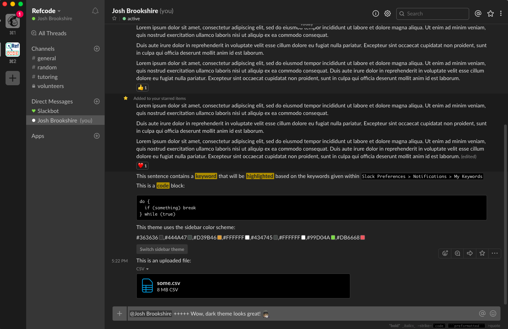

# A Minimalist Dark Theme for the Slack Desktop App

### How To:

Copy the script within the `slack_dark_theme.js` file within this repo and append it to the bottom of `/Applications/Slack.app/Contents/Resources/app.asar.unpacked/src/static/ssb-interop.js` on your local machine, beneath the existing code contained within the file, then restart Slack.

In Finder (Mac), press Shift + Command + G and paste the above path into the field and press Go

**Note:** As app updates are released, it's not uncommon for this file to be changed, requiring that the above process be repeated after each new update.

Slack's sidebar can be customized independently of this theme within the Preferences menu. If you would like to use the sidebar theme shown in the image above try these colors: 

`#363636,#444A47,#D39B46,#FFFFFF,#434745,#FFFFFF,#99D04A,#DB6668`

Simply drop that string of hex values into a channel or private message and Slack will display a "Switch sidebar theme" button to do the work for you.

While not necessary for this process, to enable Slack's developer menu enter the following via Terminal, then restart Slack: 

`launchctl setenv SLACK_DEVELOPER_MENU true`

This developer menu unlocks browser/Electron dev tools to inspect and mock up your own styling preferences and a "Reload Everything" option for a full reload without needing to quit and relaunch the app.

### Acknowledgements:
This theme builds on the excellent theme created by [@laCour](https://github.com/laCour/) available here: https://github.com/laCour/slack-night-mode
